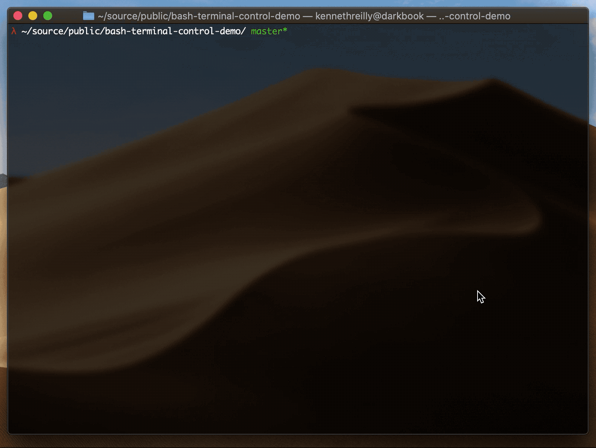

# bash-ux
Example project demonstrating how to control the terminal screen in pure Bash

## Requirements
A Bash (or compatible) shell environment is required to run this example

## Usage
* clone this repo
* run the example with `$ ./main.sh`